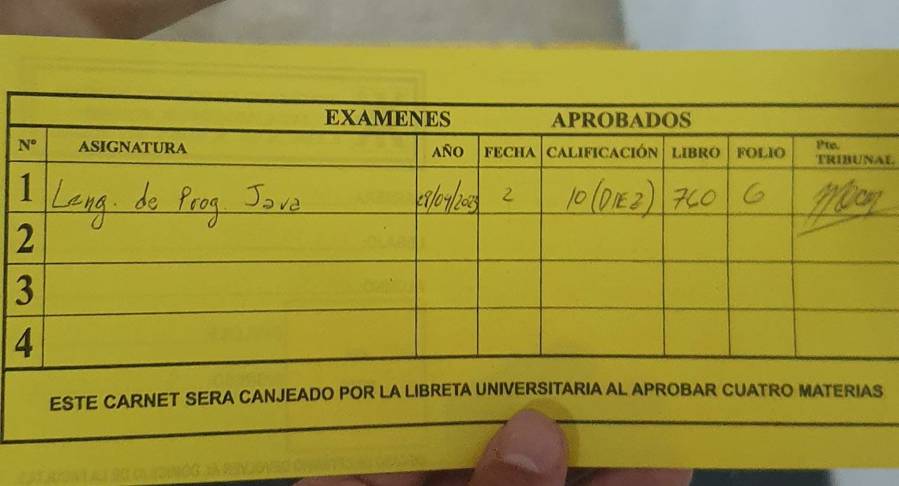

# Trabajo Practico Integrador Java

Este proyecto fue realizado para la materia electiva *Lenguaje de Programacion Java* de la UTN FRRO. Despues de mucho sufrimiento logramos terminarlo y aprobar la materia.

Los integrantes del equipo fueron:
- Ramiro Di Giacinti
- Facundo Braida
- Bruno Mollo

